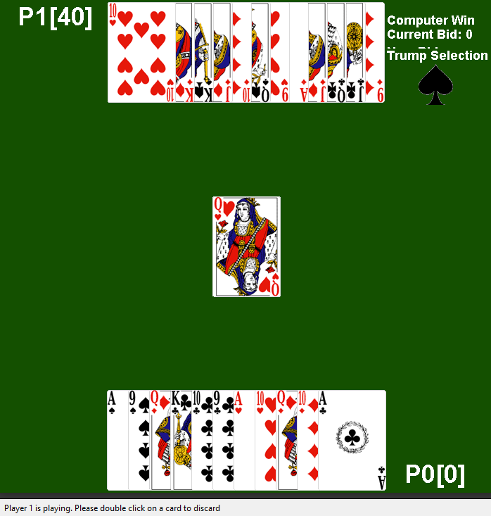
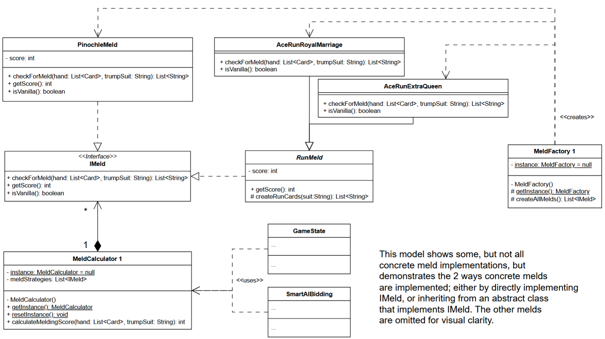

# Pinochle Video Game: University Group Project

## Introduction
A video game application for the card game Pinochle. Built using Java and the AWT library.

All game logic was initially contained in the game/Pinochle class. The goal was to refactor and extend with additional features,
and maintaining extensibility alongside **unit testing**.

What I wrote:
- Meld package
- Utils package

Where I helped implement:
- Pinochle class
- State machine and game phase managers
- Player classes

    

## Implementation
Many changes were made to the game system to address:
- Cohesion
- Extensibility
- Protected variation

We were required to redesign the system using static design models such as the one below:

    

